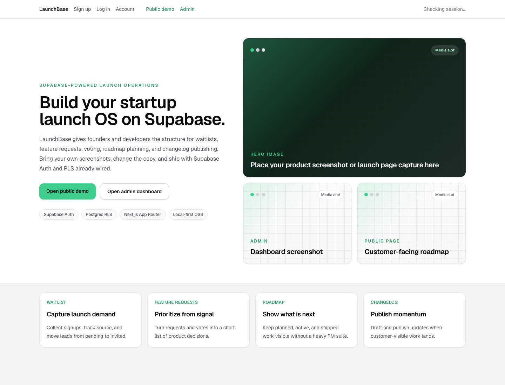
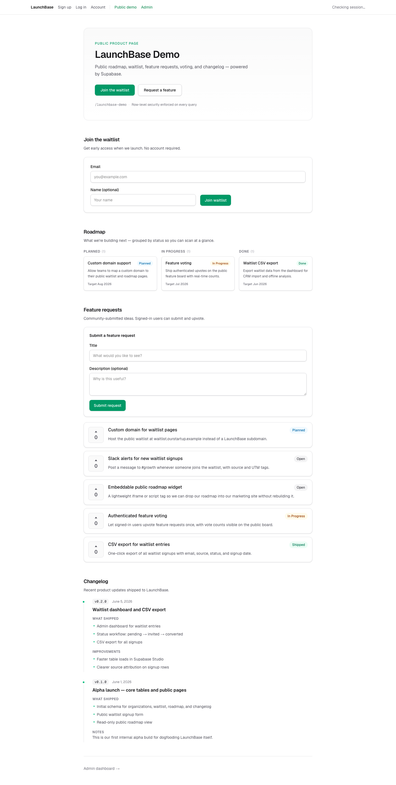
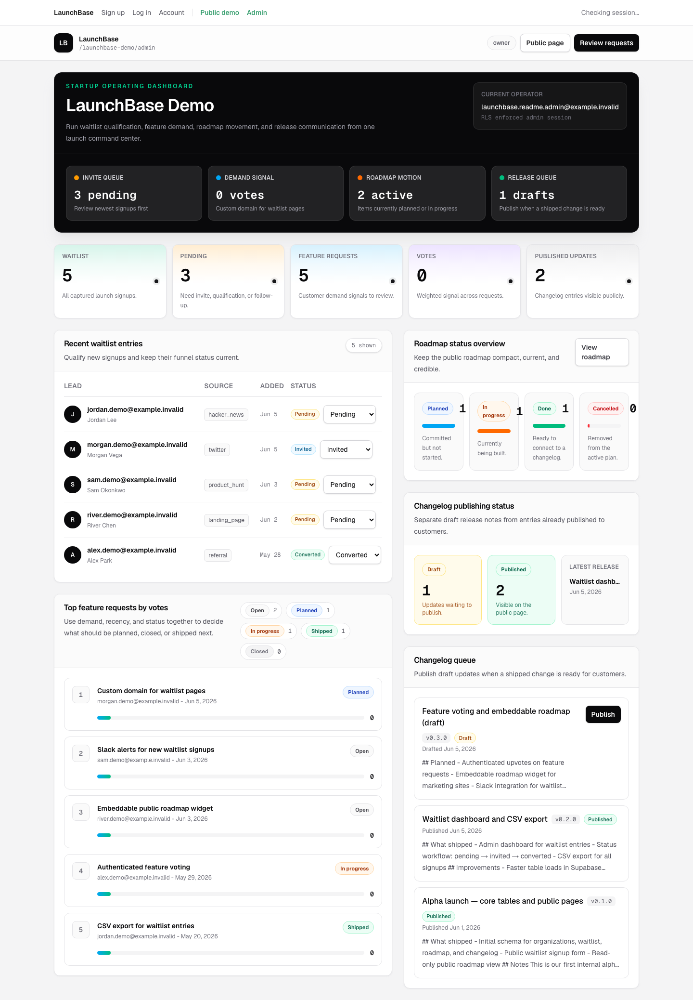

# LaunchBase

[](https://github.com/mameshivaa/launchbase/actions/workflows/ci.yml)
[](./LICENSE)
[](https://supabase.com)
[](https://nextjs.org)

**Fork a launch operations dashboard where Postgres is the permission system.**

For founders and developers who want to collect waitlist demand, turn feature requests into roadmap decisions, and publish launch momentum without building auth, permissions, and admin plumbing from scratch.



LaunchBase is an open-source, local-first starter for launch operations. It combines a public startup page with an internal dashboard for waitlists, feature requests, votes, roadmap planning, and changelog publishing.

Bring your own product screenshots, edit one config file, run Supabase locally, and start from a working Auth + RLS foundation.

## Why people fork it

- **Founders** get a practical launch dashboard instead of a static landing-page template.
- **Product teams** get waitlist, feedback, votes, roadmap, changelog, and team access in one small codebase.
- **Supabase learners** get a real Auth + RLS + RPC reference app with tests, not a toy todo list.
- **OSS builders** get a readable starter that keeps `service_role` out of the app runtime.

## Screenshots

| Public launch page | Admin operations dashboard |
| --- | --- |
|  |  |

## Use it when

- You are a **startup founder** who needs a credible launch page and a simple internal operating dashboard.
- You are a **developer** who wants a concrete Supabase Auth + RLS app to fork, study, and adapt.
- You are a **product operator** who wants waitlist, request, vote, roadmap, and changelog workflows without adopting a heavy product suite.
- You are building an **OSS SaaS template** and need a real multi-tenant security model, not a static mockup.

## What it includes

| Area | What LaunchBase gives you |
| --- | --- |
| Public launch page | Waitlist form, roadmap, feature requests, votes, changelog |
| Admin dashboard | Waitlist status workflow, demand ranking, roadmap status, changelog publishing |
| Account flow | Supabase Auth signup/login, profile row, next-step onboarding |
| Team access | Owner-created workspace, DB-backed invite links, role-based membership |
| Activity trail | Postgres-triggered launch activity log visible only to workspace admins |
| Customization | Brand copy, colors, CTA links, badges, and media slots in one config file |
| Supabase foundation | Local CLI, migrations, seed data, PostgREST, Auth, and RLS policies |

## Why Supabase is doing real work here

LaunchBase is intentionally Supabase-native. The point is not only that it stores rows in Postgres; Supabase removes whole categories of app code that an early startup usually should not hand-roll.

Concretely:

- **Auth is already tied to database identity.** Users sign up through Supabase Auth, then a Postgres trigger creates the matching `profiles` row. The app does not need a separate user bootstrap service.
- **RLS replaces a custom authorization layer.** Public visitors, authenticated users, members, owners, and admins are separated with SQL policies. The same tables can safely power public pages and admin pages.
- **PostgREST removes boilerplate CRUD routes.** The Next.js app reads and mutates tables through the Supabase client while RLS decides whether each query is allowed.
- **Postgres triggers create operational history.** Waitlist updates, feature triage, roadmap changes, changelog publishing, and team invites automatically write admin-only launch activity events.
- **The anon key stays safe by design.** The app uses only `NEXT_PUBLIC_SUPABASE_ANON_KEY` plus the current user session. No `service_role` key is used in client or server components.
- **The local CLI makes the demo reproducible.** `supabase db reset` rebuilds migrations and seed data, so contributors can reproduce the same launch workspace quickly.
- **Studio makes debugging visible.** Auth users, table rows, policies, and grants are inspectable while learning or adapting the app.

## Quick start

```bash
git clone https://github.com/mameshivaa/launchbase.git
cd launchbase
npm install

supabase start
cp .env.example .env.local
supabase status -o json
```

Copy the local Supabase values into `.env.local`:

```env
NEXT_PUBLIC_SUPABASE_URL=http://127.0.0.1:54321
NEXT_PUBLIC_SUPABASE_ANON_KEY=<ANON_KEY from supabase status>
```

Then reset the database and run the app:

```bash
supabase db reset
npm run dev
```

Open:

- Landing page: http://127.0.0.1:3000
- Public demo: http://127.0.0.1:3000/launchbase-demo
- Account: http://127.0.0.1:3000/account
- Admin dashboard: http://127.0.0.1:3000/launchbase-demo/admin

## Three-minute launch flow

1. Sign up at `/signup`.
2. Open `/account`.
3. Create a workspace. LaunchBase calls `create_organization(name, slug)` and makes you the owner in the same transaction.
4. Open `/<your-slug>/admin`.
5. Use the admin dashboard to qualify waitlist entries, invite teammates, triage feature requests, edit the roadmap, and draft/publish changelog entries.
6. Watch the Launch activity panel record those operations through Postgres triggers.
7. Open `/<your-slug>` to inspect the public launch page backed by the same Supabase tables and RLS policies.

## Local demo fallback

The normal path is workspace creation from `/account`. If you specifically want to promote a user into the seeded `launchbase-demo` organization, use the local-only fallback SQL.

1. Sign up at `/signup`.
2. Open `/account`.
3. Copy the profile ID shown on the account page.
4. Edit `scripts/local/bootstrap-admin.sql` and replace `YOUR_PROFILE_UUID`.
5. Run it in Supabase Studio SQL editor, or run:

```bash
supabase db query --file scripts/local/bootstrap-admin.sql
```

After that, open `/launchbase-demo/admin`. Do not use this fallback as a production onboarding pattern.

## Customize the startup landing page

Edit:

```text
src/config/landing-page.ts
```

You can change:

- Brand name, eyebrow, headline, and supporting copy
- Supabase-style accent colors
- CTA labels and links
- Stack badges
- Hero image and screenshot slot labels
- Operation card text

The default UI includes media placeholders so a startup can attach its own product screenshot, admin dashboard screenshot, or public roadmap capture.

## Supabase schema

LaunchBase creates 10 core tables:

1. `profiles`
2. `organizations`
3. `organization_members`
4. `organization_invitations`
5. `waitlist_entries`
6. `feature_requests`
7. `feature_votes`
8. `roadmap_items`
9. `changelogs`
10. `launch_activity_events`

Every product row is scoped by `organization_id`. RLS policies define the public, authenticated, member, owner, and admin access model.

See [docs/supabase.md](./docs/supabase.md) for the architecture walkthrough.

## Security model

- Anonymous users can read the public launch surface, join the waitlist, and read aggregate vote counts.
- Authenticated users can update their own profile, create a workspace, accept invitations, submit feature requests, and vote.
- Organization owners/admins can invite teammates, read waitlist PII, update waitlist status, manage roadmap data, and publish changelog entries.
- Launch activity is written by Postgres triggers and readable only by organization owners/admins.
- Invitation tokens are hashed in Postgres; raw invite links are returned only when created or rotated.
- Raw vote rows are not publicly readable; public pages use `get_feature_vote_counts(org_id)`.
- The app never uses `service_role` in Next.js client or server components.
- The browser and server use only the Supabase anon key plus the current user session.
- The app sends baseline security headers through Next.js `proxy.ts`, including CSP, clickjacking protection, content sniffing protection, referrer policy, and a restrictive permissions policy.
- Publicly writable inputs are normalized in the UI and bounded again by Postgres CHECK constraints.

Use [docs/security-checklist.md](./docs/security-checklist.md) and
[docs/security-operations.md](./docs/security-operations.md) before publishing
your fork.

## Project structure

```text
src/
├── app/                  # Next.js App Router routes
├── components/           # Auth, public, account, and admin UI
├── config/               # Startup-customizable landing page config
├── domain/entities/      # Shared TypeScript entity types
└── lib/                  # Supabase clients and helpers

docs/assets/              # Real README screenshots captured from the app

supabase/
├── config.toml
├── seed.sql
└── migrations/

scripts/local/
└── bootstrap-admin.sql
```

## Scripts

| Command | Description |
| --- | --- |
| `npm run dev` | Start the Next.js dev server |
| `npm run build` | Build the app for production |
| `npm run lint` | Run ESLint |
| `npm run security:headers` | Check security headers on a running app |
| `npm run test:rls` | Run local RLS smoke tests against Supabase |
| `supabase start` | Start the local Supabase stack |
| `supabase db reset` | Reapply migrations and seed data |
| `supabase status` | Show local Supabase URLs and keys |

For `npm run test:rls`, export `SUPABASE_URL`, `SUPABASE_ANON_KEY`, and local-only `SUPABASE_SERVICE_ROLE_KEY` from `supabase status`.

## Deploy

Use [docs/deploy.md](./docs/deploy.md) for the Vercel + Supabase Cloud path:

1. Create a Supabase Cloud project.
2. Apply migrations.
3. Set Vercel environment variables.
4. Configure Auth site URL and redirect URLs.
5. Enable production SMTP before relying on email confirmations or password resets.

## Current scope

LaunchBase is intentionally small and readable. These are not included yet:

- Billing
- Managed hosted SaaS operations
- Built-in email provider integration

## Contributing

LaunchBase is intentionally scoped as an OSS starter, not a hosted SaaS. Useful contributions include tighter RLS tests, better seed data, production deploy notes, and workflow improvements that keep the codebase easy to fork.

Read [CONTRIBUTING.md](./CONTRIBUTING.md) before opening a PR.

## Security

If you find an auth, RLS, invite-token, or data exposure issue, please do not open a public issue. Follow [SECURITY.md](./SECURITY.md).

## License

[MIT](./LICENSE)
